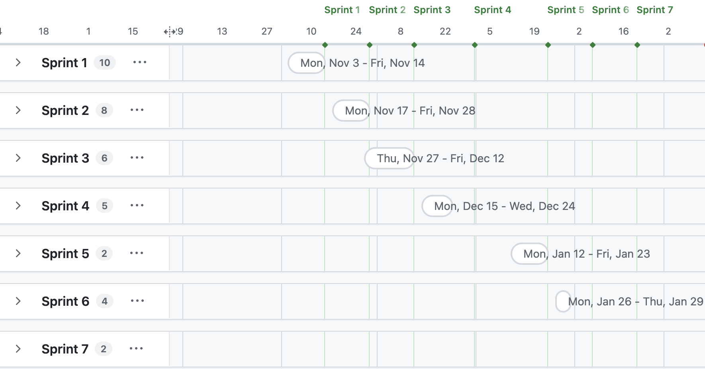
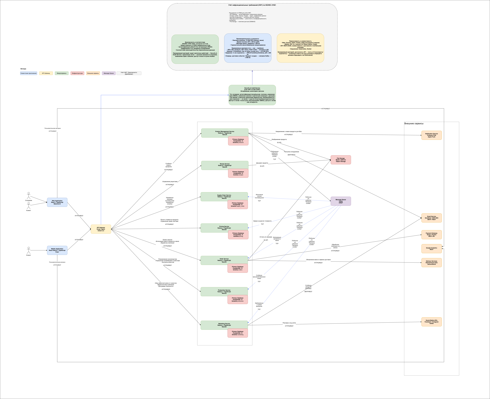

= Внедрение системы для автоматизации процесса создания нового продукта

== Общая информация
Проект предполагает создание веб-платформы (или десктопного приложения) для автоматизации процесса запуска нового продукта. Инструмент, названный условно “Система управления продуктами”, объединит работу маркетинга, разработки, производства, продаж и других отделов в едином цифровом пространстве. Это позволит сократить время на координацию, минимизировать ошибки ручного ввода и обеспечить прозрачность на всех этапах — от идеи до релиза. Платформа будет работать по принципу workflow-автоматизации, генерируя задачи на основе шаблонов продуктов и уведомляя ответственных в реальном времени.

Ключевые функции:
[.punkt]
. Единое рабочее пространство.
. Автоматическая генерация задач.
. Система уведомлений.

Для сотрудников предоставляется функциональность для полного цикла вывода нового продукта на рынок:
[.punkt]
. Создание эпика для нового продукта.
. Автоматическая генерация задач на все необходимые отделы.
. Оповещение отделов о появлении новой задачи.
. Оповещение о просрочках задачи.
. Интеграция нового продукта в меню при успешном завершении цикла вывода нового продукта.
. Сбор бизнес метрик, клиентских метрик.

== Цель внедрения проекта
Разработать автоматизированный инструмент “Система управления продуктами” для централизованного управления процессом создания нового продукта, обеспечивающий интеграцию работы отделов, автоматическую генерацию задач на основе шаблонов и реального времени уведомления ответственных лиц о новых задачах и изменениях статуса.

== Стек технологий
.Используемые технологии
* Frontend: Node.js, TypeScript, Express, NestJS, React
* Backend: Node.js, Express
* Primary Database: PostgreSQL
* API Gateway: Kong / Nginx, OAuth 2.0
* Message Queue: Apache Kafka
* Синхронные взаимодействия: REST API 

== Описание проекта и основных решаемых задач
.Сроки разработки: 
* Спринтов: 5 по 2 недели
* Начало первого спринта: 01.11.2025
* Завершение последнего спринта: 06. 02.2026

.Решаемые задачи по спринтам:
* Спринт 1 (03.11 - 14.11 2025): подготовка бизнес требований
* Спринт 2 (17.11 - 28.11 2025): проектирование процессов и подготовка системных требований
* Спринт 3 (27.11 - 12.12 2025): проектирование интерфейса и начало разработки
* Спринт 4 (15.12 - 31.12 2025): разработка основной  логики  и статусной модели, подготовка к тестированию
* Спринт 5 (12.01 - 23.01 2026): завершение разработки, проведение тестирования и демонстрация готового продукта.
+
Далее демо будущим пользователям и сопровождение.
* Спринт 6 (26.01 - 6.02 2026): доработки по выявленным дефектам и запас на криичные доработки.

== Roadmap проекта (диаграмма Ганта)
[#cn-cc]
.Диаграмма Ганта

== Команда проекта
Всего 13 человек в команде:
[.punkt]
. Системный аналитик Junior
.. Confluence - для документирования требований
.. OpenApi - для проектирования API
.. Draw.io - для создания схем (BPMN, sequence и пр.)
. Системный аналитик Middle
.. Confluence - для документирования требований
.. OpenApi - для проектирования API
.. Postman - для тестирования API
. Системный аналитик Lead
.. Jira - для ведения бэклога
.. Confluence - для документирования требований
. Дизайнер
.. Figma - для макетов
.. Storybook - для библиотеки UI-компонентов
. 2 backend-разработчика
.. JavaScript / TypeScript - для серверной части приложения
.. PostgreSQL для работы с БД
. 2 frontend-разработчика 
.. React и JavaScript / TypeScript - для клиентской части приложения
. 2 бизнес аналитика
.. Google Sheets - для построения дашбордов, выполнения бизнес-расчетов
.. Miro - для прототипов бизнес-требований
. 2 тестировщика
.. Postman - для тестирования API
.. Playwright - для E2E и UI тестов
. 1 DevOps разработчик
.. Docker - для сборки приложения в контейнеры
.. GitHub Actions - для CI/CD
.. Prometheus + Grafana - для мониторинга и логов

== Риски проекта
[cols="1,1,1,1,1,1", hrows=1]
|==== 
| Категория рисков
| Риск
| Вероятность наступления риска
| Степень влияния риска
| Последствия
| Управление риском

| Технические риски
| Трудности с обеспечением высокой доступности и отказоустойчивости системы
| 2
| 3
| Недоступность важного для рабочего процесса инструмента 
| Мониторинг системы. Предусмотреть динамическую инфраструктуру или запас “железа”

| Оценка сроков
| Недостаточное понимание объема работы и сложности задач
| 4
| 4
| Увеличение сроков реализации
| Регулярные демо заказчику. Регулярная синхронизация по задачам

| Оценка сроков
| Проблемы с планированием и приоритизацией задач
| 3
| 4
| Увеличение сроков реализации
| Регулярная синхронизация по задачам

| Интеграционные
| Сложности в адаптации существующей инфраструктуры под новое решение
| 5
| 3
| Процессы могут некорректно работать
| Учесть при проектировании новой системы

| Интеграционные
| Необходимость изменения рабочих процессов и адаптация персонала
| 3
| 1
| Сложности в выполнении своих обязанностей у сотрудников
| Учесть при проектировании процессов 

| Приемка продукта
| Сложности в адаптации пользователей к новому интерфейсу и функционалу
| 2
| 1
| Сложности в выполнении своих обязанностей у сотрудников
| Подготовить инструкции для пользователей с разными ролями 

| Приемка продукта
| Недостаточное участие и вовлечение пользователей в процесс разработки и тестирования
| 3
| 1
| Продукт, которым неудобно пользоваться
| Добавить пользовательские метрики, опросники

| Несоблюдение технологий
| Технические сбои и нештатные ситуации, которые могут повлиять на работу технологии
| 1
| 4
| Недоступность важного для рабочего процесса инструмента 
| Мониторинг системы. Предусмотреть возможность отката на стабильную версию

| Несоблюдение технологий
| Проблемы с обучением и поддержкой персонала в использовании новой технологии
| 3
| 1
| Несоблюдение нового процесса
| Подготовить инструкции для пользователей с разными ролями
| Проведение демо пользователем с прямым путем их действий
|==== 

== Описание выбранного решения (общие сведения)
Архитектура построена на комбинации Service-Oriented Architecture (SOA) и Event-Driven Architecture (EDA):
[.punkt]
. SOA: Каждая система представляет собой независимый сервис с четко определенными API и ответственностью
. EDA: Асинхронная коммуникация между системами через события для снижения связанности и повышения отказоустойчивости

Принципы взаимодействия
[.punkt]
. Слабая связанность: Системы взаимодействуют через события и API, не зная о внутренней реализации друг друга
. Высокая связность: Компоненты внутри системы тесно связаны и работают как единое целое
. Масштабируемость: Каждая система может масштабироваться независимо
. Отказоустойчивость: При недоступности одной системы остальные продолжают работать

В центре архитектуры находится “Система управления продуктами”, которая содержит четыре основных компонента: ProductController для обработки HTTP-запросов, ProductService для бизнес-логики, ProductIntegrationService для координации интеграций и ProductRepository для доступа к данным. Эта система взаимодействует с “Системой управления заказами” через REST API для синхронизации меню и через события для уведомления о создании продуктов.

“Система управления складом” получает информацию о новых ингредиентах через API и реагирует на события создания продуктов, автоматически планируя закупки. “Система управления производством” получает рецепты через API и уведомляется о новых продуктах через события для подготовки производственных процессов.

“Система аналитики” подписывается на события от всех систем для сбора метрик и формирования отчетов, которые могут использоваться для принятия решений о продуктах. “Шлюз интеграций” обеспечивает связь с внешними системами (доставка, платежи) и маршрутизирует события между внутренними системами.

Взаимодействие построено на комбинации синхронных REST API вызовов (для критичных операций) и асинхронных событий (для уведомлений и слабосвязанных операций), что обеспечивает масштабируемость, отказоустойчивость и гибкость системы.

== Описание архитектуры проекта (с НФТ)

=== Основные контейнеры
==== Система управления продуктами (Product Management System)

Назначение: Центральная система для создания, управления и координации внедрения новых продуктов.

Основные функции: 
[.punkt]
. Создание и редактирование продуктов
. Управление жизненным циклом продукта
. Координация процесса внедрения
. Интеграция с другими системами

2.2 Система управления заказами (Order Management System)
Назначение: Обработка заказов клиентов и интеграция нового продукта в меню.

Основные функции:
Прием и обработка заказов
Управление меню
Интеграция с платежными системами
Синхронизация с фронтенд-приложениями

==== Система управления складом (Warehouse Management System)
Назначение: Управление запасами ингредиентов и продуктов.

Основные функции:
[.punkt]
. Учет ингредиентов
. Автоматическое планирование закупок
. Контроль сроков годности
. Управление поставками

==== Система управления производством (Production Management System)
Назначение: Управление процессом приготовления блюд на кухне.

Основные функции:
[.punkt]
. Управление рецептами
. Координация приготовления заказов
. Интеграция с конвейерами и роботами
. Мониторинг производственных процессов

==== Шлюз интеграций (Integration Gateway)
Назначение: Централизованная точка интеграции с внешними системами.

Основные функции:
[.punkt]
. Интеграция с сервисами доставки (UberUniverse Eats, DeliverWorld)
. Интеграция с платежными системами
. Управление API-ключами и аутентификацией
. Трансформация данных между системами

=== Безопасность

Выбранный фреймворк: ISO/IEC 27001 (информационная безопасность, СУИБ).

Учёт требований к безопасности осуществляется следующим образом:

Политики и организационные меры (ISO 27001, раздел 5 - 8): определение целей безопасности, ролей, рисков и возможностей; документирование политик и процедур.
Контроли приложений (Annex A): применяются релевантные контроли из приложения A (A.5–A.8 и др.), в частности:
[.punkt]
. A.5 — организационные меры (политики, разделение обязанностей, контакт с властями).
. A.6 — кадровая безопасность.
. A.7 — управление активами (учет, обработка, носители).
. A.8 — криптография, эксплуатация средств обработки, коммуникации, закупки и отношения с поставщиками, инциденты, аспекты БК.

В архитектуре это отражено централизованным учётом через API Gateway (аутентификация OAuth 2.0, авторизация), отдельным Security & Audit Service и требованиями к БД, хранилищам и очередям (доступ, шифрование, резервное копирование).

Описание Security & Audit Service:
[.punkt]
. События логирования: аутентификация (вход/выход), платежи, изменение прав (RBAC), изменение заказов и критичные операции с данными.
. Место хранения: отдельное хранилище (append-only, неизменяемость); срок хранения — не менее 1 года (по политике/законодательству).
. Доступ к логам: только роль Security/Auditor (RBAC), доступ к логам сам логируется.

=== Ключевые нефункциональные требования
==== Безопасность и соответствие законодательству и стандартам

[.punkt]
. Защита данных от несанкционированного доступа и вредоносных атак.
. Аутентификация: OAuth 2.0 через API Gateway.
. Авторизация: RBAC для сотрудников и клиентов.
. Шифрование: TLS для всех каналов (клиент–шлюз, шлюз–сервисы, внешние API).
. Резервное копирование баз данных и критичных данных в соответствии с политикой по ISO 27001.
. Соответствие требованиям к обработке персональных данных (в т.ч. законодательство РФ/ЕС при применимости).

==== Производительность и мощность

[.punkt]
. Пиковые нагрузки: система должна выдерживать до 10 000 RPS по сценариям «просмотр меню» и «оформление заказа» в часы пик.
. Время отклика API: p95; 200 мс для основных операций.
. Message Queue (Kafka): задержка доставки сообщений; 500 мс.
. Масштабирование: горизонтальное масштабирование микросервисов и при необходимости узлов БД/очередей.

==== Переносимость и совместимость

[.punkt]
. Web-приложение: поддержка последних двух мажорных версий браузеров Chrome, Safari, Firefox, Edge.
. Мобильное приложение: iOS 14+, Android 10+ (React Native / Expo).
. API: REST/JSON; совместимость с внешними системами (доставка, платёжные шлюзы).
. Окружение: контейнеризация (Docker), оркестрация (Kubernetes).

Итоговая диаграмма контейнеров приложена в формате drawio.
[#cn-cc]
.Диаграмма контейнеров

== Заключение
В рамках данной работы выполнено следующее

[.punkt]
. Спроектирована система по созданию и управлению нового продукта.
. Выявлены и оценены потенциальные риски.
. Спроектирована архитектура на основе комбинации Service-Oriented Architecture (SOA) и Event-Driven Architecture (EDA).